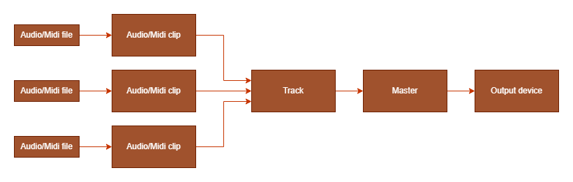

import { LinkCard } from "@astrojs/starlight/components";
import { CardGrid } from "@astrojs/starlight/components";
import { Steps } from "@astrojs/starlight/components";

## The framework structure

The framework act as a suite of tools to create audio applications.

It offers several features like clips to manage and play audio and midi files, tracks to group clips and apply the same effects on all of them, plugins support to process and generate sounds and general help in making sequence based audio applications.

Here is a general scheme of the audio graph.

<Steps>

1. Clips are created from an audio or midi file input.

2. Clips are added to audio or midi tracks, which have controls like volume and panning which affect all their clips and process the sound through plugins.

3. Tracks send processed audio to the master mixer, which stores all the tracks.

4. The master mixer sends tracks audio to the output device.

</Steps>

After this quick walkthrough we are ready to start!

<CardGrid>
  <LinkCard title="Installation" href="/getting-started/installation" description="Prev" />
  <LinkCard title="Usage example" href="/getting-started/usage-example" description="Next" />
</CardGrid>
