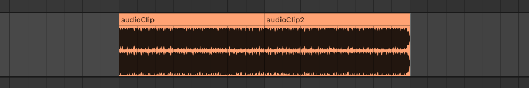
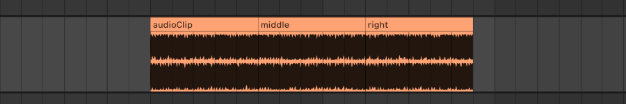
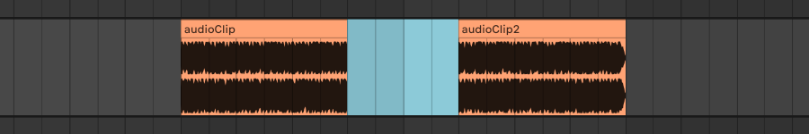

import { LinkCard } from "@astrojs/starlight/components";
import { CardGrid } from "@astrojs/starlight/components";
import { Aside } from "@astrojs/starlight/components";

Audio clips are used to load, store and play audio files.

As a real application example, just think of a video editor or a digital audio workstation where you can move audio clips on a timeline.

## Creation

To create a new audio clip we need an audio file e.g `sound.wav`.

With that done we can create a new audio clip as below.

```cs
var audioClip = new AudioClip("path/to/sound.wav");
```

## Parameters

There are several parameters we can customize; some can be changed during playback, others can't.

### Tweakable parameters

Here is list of the tweakable audio clip parameters:

- `Enabled`: changes the clip enabled/disabled state. If the clip is disabled it won't be played.
- `Name`: represents the name of the clip. For audio clips it defaults to the audio file name.
- `Time`: represents the time of the clip on a timeline. This isn't used by the framework as per se, but can be useful for the user to define when the clip should be played or where should be positioned.
- `StartMarker`: defines at what seconds the clip playback should start from. Eg. for an audio file of 30s and a **StartMarker** of 8s, the clip will start playing from 8s.
- `EndMarker`: defines at what seconds the clip should stop playing. Eg. for an audio file of 30s and an **EndMarker** of 24s, the clip will play from 0s to 24s.
- `FadeIn`: fade in seconds at the beginning of the sound.
- `FadeOut`: fade out seconds to the end of the sound.
- `Volume`: volume of the clip in dB. Ranges from -90 (completely silent) to +6 (clipping). Default value is zero.
- `Pan`: panning amount of the clip (how much the sound should be heard from left and right). Ranges from -50 (100% left) to +50 (100% right). Default value is zero.
- `Pitch`: changes the pitch of the sound in semitones without making it play faster or slower. Eg. 6 means six semitones up, -4 means four semitones down. Default value is zero.
- `Speed`: changes the speed of the playback. Eg. 2 means double speed, 0.5 means half speed. Default value is one. _Note that this can't be changed while the clip is playing_.

### Not tweakable parameters

Here is list of not tweakable audio clip parameters:

- `Id`: an unique id in the form `5cafb3a8-dba4-47ce-9e58-03d972526c50` that could be useful to distinguish between clips or to the user.
- `FilePath`: represents the file path of the audio file used by the audio clip.
- `CurrentTime`: represents the current time of the clip playback.
- `IsPlaying()`: indicates if the clip is currently playing.
- `Duration`: represents the total duration of the clip. It takes into account starting/ending markers and the speed properties of the clip.
- `IsAudioClip`: indicates if it is an audio clip or not.
- `IsMidiClip`: indicates if it is a midi clip or not.
- `Track`: the track which contains the clip if any.
- `IsInTrack`: indicates if the clip is inside a track.
- `AudioFile`: **AudioFileReader** instance of NAudio for the clip audio file. (shouldn't be touched for most cases)
- `MidiFile`: not used for audio clips.
- `Automations`: dictionary which contains all the clip automations. (see the automations article for guidance)

## Operations

We can do some operations with audio clips. Here is a list:

- `Play()`: starts the clip playback.
- `Stop()`: stops the clip playback.
- `Seek()`: go to a specific time during playback. (must be between **StartMarker** and **EndMarker**)
- `Split()`: splits the clip in twos at the specified time. Returns a new clip which represents the rightmost part.
- `SplitFromTo()`: splits the clip in threes from time to time. Returns two new clips which represent the middle and rightmost part.
- `CutOut()`: cuts out a part of the clip from time to time. Returns a new clip which represent the rightmost part.
- `Reverse()`: reverses the clip. _Will do nothing if called while the clip is playing_
- `Duplicate()`: creates an unique copy of the audio clip.
- `GetDuration()`: gets the real duration of the audio file used by the audio clip.
- `SaveProcessedAudioFile()`: saves the processed audio file on disk.
- `AddAutomationPoint()`: adds an automation point for a parameter at a specified time.
- `ClearAutomation()`: clears an automation for a parameter.
- `ClearAllAutomations()`: clears all automations of the audio clip.

<Aside type="caution">
  `Reverse` generates a new audio file which is saved in the specified directory
  with "\_rev" appended to the file name. The ideal usage would be to use a common
  directory for reversed files generated from your app, this way if you call
  `Reverse` multiple times on the same audio clip, there will be only one
  generated file since it will be replaced each time.

After reversing an audio clip its `FilePath` will always be relative to the new generated file, even when reversed back.

**It is your task to cleanup the "\_rev" files when not needed anymore.**

</Aside>

<Aside type="note">
  `Split` `SplitFromTo` `CutOut` work by just adjusting the `StartMarker` and `EndMarker` properties without touching the original file data, so we can always revert to a previous state.

See the examples below for guidance.

</Aside>

<Aside type="note">
  Clips must be inside tracks to be played. (see the tracks articles)
</Aside>

### Examples

Some examples of operations we can do on audio clips.

#### Split

Here we split a generic audio clip of 10s into two parts.

```cs
// Split the clip at 5 seconds and return the right splitted part as a new audio clip
var audioClip2 = audioClip.Split(5);
```



#### SplitFromTo

Here we split a generic audio clip of 12s from 4s to 8s.

```cs
// Split the clip from 4 seconds to 8 seconds and return the middle and rightmost splitted parts as new audio clips
var clips = audioClip.SplitFromTo(4, 8);
clips.middle; // Access the middle audio clip
clips.right; // Access the rightmost audio clip
```



#### Cut

Here we cut out a piece of a generic audio clip from 4s to 8s.

```cs
// Cut out the clip from 4 sec to 8 sec and return the right part as a new audio clip
var audioClip2 = audioClip.CutOut(4, 8);
```



#### SaveProcessedAudioFile

The method saves the audio clip file on disk processed by all clip parameters and automations. (StartMarker, Volume, Pan, Pitch and so on)

```cs
// Save the processed audio clip at given path
audioClip.SaveProcessedAudioFile("path/to/processed.wav");
```

## Events

There are some events we can subscribe to in order to execute certain actions when a parameter changes.

- `EnableChanged`: called when the clip `Enabled` property has been changed.
- `EndMarkerChanged`: called when the clip `EndMarker` property has been changed.
- `NameChanged`: called when the clip `Name` property has been changed.
- `PanChanged`: called when the clip `Pan` property has been changed.
- `PitchChanged`: called when the clip `Pitch` property has been changed.
- `StartMarkerChanged`: called when the clip `StartMarker` property has been changed.
- `TimeChanged`: called when the clip `Time` property has been changed.
- `VolumeChanged`: called when the clip `Volume` property has been changed.

### Example

In this example we update the `Time` parameter of the audio clip to reflect changes of `StartMarker`.

```cs
var audioClip = new AudioClip("path/to/sound.wav");

audioClip.StartMarkerChanged += (sender, e) =>
{
    double changeLength = e.NewTime - e.OldTime;
    audioClip.Time += changeLength;
};

// here audioClip.Time is still 0
audioClip.StartMarker = 2;
// here audioClip.Time is 2
```

<CardGrid>
  <LinkCard
    title="Midi devices"
    href="/main-concepts/devices/midi-devices"
    description="Prev"
  />
  <LinkCard title="Midi clips" href="/main-concepts/clips/midi-clips" description="Next" />
</CardGrid>
